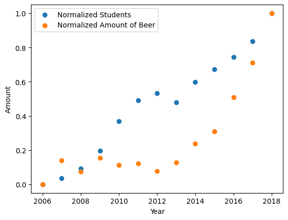

# StudentID: 16162021
## References
1. Van Dyke, M. C. C., Teixeira, M. M., & Barker, B. M. (2019).*Current Opinion in Microbiology, 52*, 55–63.   [Fantastic yeasts and where to find them: the hidden diversity of dimorphic fungal pathogens](https://www.sciencedirect.com/science/article/pii/S136952741930013X). 
2. Harvey, J. T., Culvenor, J., Payne, W. R., Cowley, S., Lawrance, M., Stuart, D., & Williams, R. (2002). *Applied Ergonomics, 33(6)*, 523–531.  [An analysis of the forces required to drag sheep over various surfaces](https://www.sciencedirect.com/science/article/pii/S0003687002000716). 
3. Zeigler, D. W., Wang, C. C., Yoast, R. A., Dickinson, B. D., McCaffree, M. A., Robinowitz, C. B., & Sterling, M. L. (2005).*Preventive Medicine, 40(1)*, 23–32. [The neurocognitive effects of alcohol on adolescents and college students](https://www.sciencedirect.com/science/article/pii/S0091743504002658).
    
## Data Visualization

## Data interpretation
Once the data has been plotted, it can be observed that there is a negative correlation between Number of Students in Dutch Universities and the total consumption of beer in the Netherlands for 2009- 2012. From 2013 onwards,  there is strong correlation between the two suggesting, a possiblity with more active student life:)
